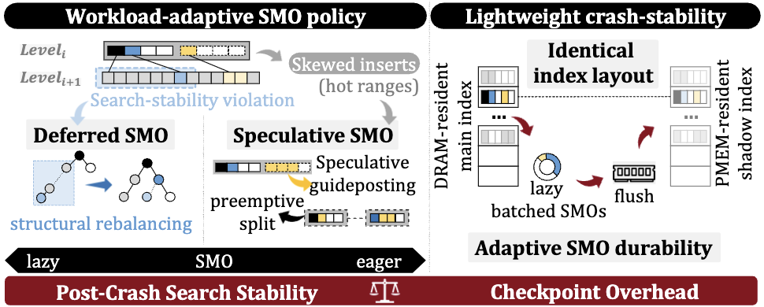
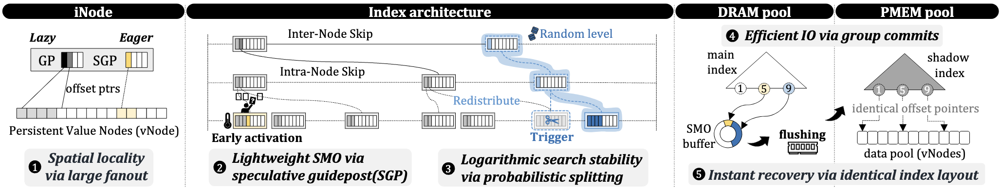

# SpectrumKV: Workload-Adaptive Indexing for Key-Value Stores on Heterogeneous Memory Systems
**SpectrumKV** is a write-efficient, recovery aware indexing framework designed for key-value (KV) stores running on heterogeneous memory systems, particuliarly those incorporating non-volatile memory(NVM).
Traditional systems often treat index and data updates equally, resulting in frequent small writes on the critical path that degrade performacne. **SpectrumKV** addresses this by decoupling indexing from data persistence through two core ideas:

1. Adaptive structure modification operations (SMOs):
    - Deferred SMOs delaying rebalancing and persistence of structural changes to reduce write amplification and interference with foreground operations.
    - Speculative SMOs proactively allocates routing capacity under skewed insertions to avoid hotspots.
3. Dual-layer, asymmetric indexing:
   - A fast, DRAM-resident main index handles query processing.
   - A crash-consistent shadow index in NVM uaranteed safe recovery without requiring synchronous writes.

Across diverse workloads, **SpectrumKV** significantly improves write throughput, reduces persistence overhead, and enables instant recovery.

This document serves as a comprehensive guide to understanding **SpectrumKV**'s underlying logic and its implementation at the code level. It also provides instructions on how to reproduce evaluations.

### Index Architecture Overview
**SpectrumKV** is built around a dual-layer, workload-adaptive design that decouples fast in-memory operations from durable persistent structures. Figure2 in the paper highlights the key implementation concepts:

- **iNode design**
  
**SpectrumKV** stores value metadata in persistent value nodes (vNodes) `implemented as valuelist` and uses iNodes `implemented as dramSkiplist` to reference them with high fanout.

- **Speculative SMOs**

**SpectrumKV** performs preemptive node splits and uses SGPs to anticipate where structure changes may be needed.

- **Deferred SMOs**


Updates to the DRAM-resident main index are accumulated in an SMO buffer and committed to NVM in batches when the disparity between the two indexes reaches a maximum threshold.

- **Instant recovery via identical index layout**

The NVM-resident shadow index mirrors the layout of the DRAM index using identical offset pointers. After a crash, SpectrumKV reconstructs the in-memory index directly from the shadow index. Recovery requires no replay or log scanning, enabling near-instant restart.


## Repository Structure
```
.
├── include/        # Public headers for SpectrumKV data structures and APIs
├── src/            # Core implementation of the SpectrumKV indexing framework
├── test/           # Unit tests, microbenchmarks, and validation workloads
├── Makefile        # Build rules and compilation targets
└── run_spect.sh    # Benchmark running and cleanup
```

## Building SpectrumKV
### Requirements and dependencies
- C++17 or newer  
- GCC or Clang  
- PMDK (libpmemobj)

SpectrumKV is configures for persistent memory. A configured PM path is necessary; skip if you have a configured path.
```
# set Optane DCPMM to AppDirect mode
sudo ipmctl create -f -goal persistentmemorytype=appdirect
# configure PM device to fsdax mode
sudo ndctl create-namespace -m fsdax
# create and mount a file system with DAX
sudo mkfs.ext4 -f /dev/pmem0
sudo mount -o dax /dev/pmem0 /mnt/pmem0
```

  
### Build Instructions
```
git clone https://github.com/SNU-DBXLab-papers/SpectrumKV.git
cd SpectrumKV
make -j$(nproc)
```
a benchmarking binary will be generated `./project`

## Running YCSB
```
./run_spect.sh [workload] [distribution] [thread_num] # --insert-only for exit after LOAD BULK
```
Parameters:
```
-workload
  a #(50% Read, 50% Update)
  b #(95% Read, 5% Update)
  c #(100% Read)
  d #(95% Read, 5% Lastest Update)
  e #(95% Scan, 5% Update)
  g #(99% Read,1% Insert) custom for recovery testing (index convergence)
-distribution
  unif
  zipf
-thread_num
```
## For comparison with baselines
Please see baselines [PRISM](https://github.com/cosmoss-jigu/prism) and [FluidKV](https://github.com/luziyi23/FluidKV) for comparison benchmarking

## Authors
- CHEN QICHEN
- ZGUEM SARA
- JUNG HYUNGSOO
